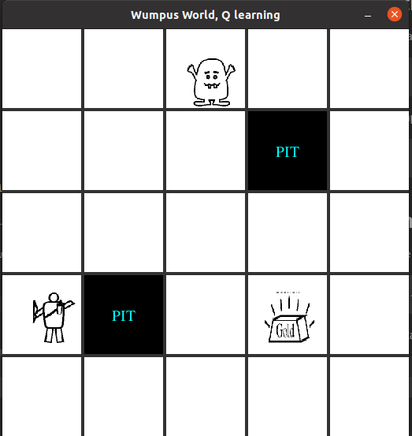

# Q-learning-Wumpus-Problem

This is the implementation code to solve the wumpus problem with reinforcement learning by Q-learning.


## Requirements
* pygame
* numpy

## Installation
* Install pygame
```
pip install pygame
```
* Install numpy
```
pip install numpy
```

## Run demo
To run the code execute following command .
```
python main.py --epsilon <epsilon> --lr <LEARNING_RATE> --gamma <GAMMA> --num_epochs <EPOCHS>
```
The program starts and then you have to select the item positions.(robot, wumpus, hole1, hole2, gold)

### Program environment image
